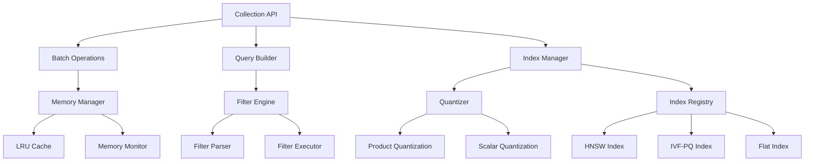

# Design Document

## Overview

This design implements Phase 3 competitive features for LibraVDB, transforming it from a solid foundation into a production-ready vector database that can compete with Pinecone, Qdrant, and Weaviate. The design focuses on five core areas: vector quantization for memory efficiency, advanced metadata filtering, high-performance batch operations, multiple index algorithms, and comprehensive memory management.

The architecture maintains LibraVDB's existing strengths (embedded Go library, HNSW performance, persistence) while adding enterprise-grade capabilities. All new features integrate seamlessly with the current layered architecture: `libravdb` (public API) → `internal/index` (algorithms) → `internal/storage` (persistence) → `internal/obs` (observability).

## Architecture

### Current Architecture Enhancement

The design extends the existing architecture with new components:

```
libravdb/
├── collection.go          # Enhanced with batch ops, quantization config
├── options.go            # New quantization, memory, index options  
├── query.go              # Enhanced metadata filtering
├── batch.go              # NEW: Batch operations API
└── memory.go             # NEW: Memory management API

internal/
├── quant/                # NEW: Quantization implementations
│   ├── interfaces.go     # Quantizer interface
│   ├── product.go        # Product Quantization (PQ)
│   ├── scalar.go         # Scalar Quantization
│   └── registry.go       # Quantizer factory
├── index/
│   ├── hnsw/            # Existing HNSW (enhanced)
│   ├── ivfpq/           # NEW: IVF-PQ index
│   ├── flat/            # NEW: Flat/brute-force index
│   └── interfaces.go    # Enhanced with quantization support
├── memory/              # NEW: Memory management
│   ├── manager.go       # Memory limit enforcement
│   ├── cache.go         # LRU cache implementation
│   └── monitor.go       # Memory usage monitoring
└── filter/              # NEW: Metadata filtering engine
    ├── parser.go        # Query filter parsing
    ├── executor.go      # Filter execution
    └── optimizer.go     # Filter optimization
```

### Component Interactions



## Components and Interfaces

### 1. Vector Quantization System

#### Quantizer Interface
```go
type Quantizer interface {
    // Training and configuration
    Train(ctx context.Context, vectors [][]float32) error
    Configure(config QuantizationConfig) error
    
    // Compression and decompression
    Compress(vector []float32) ([]byte, error)
    Decompress(data []byte) ([]float32, error)
    
    // Distance computation on compressed vectors
    Distance(compressed1, compressed2 []byte) (float32, error)
    DistanceToQuery(compressed []byte, query []float32) (float32, error)
    
    // Metadata
    CompressionRatio() float32
    MemoryUsage() int64
}

type QuantizationConfig struct {
    Type        QuantizationType
    Codebooks   int     // For PQ
    Bits        int     // Bits per component
    TrainRatio  float64 // Training data ratio
    CacheSize   int     // Codebook cache size
}
```

#### Product Quantization Implementation
- **Training**: K-means clustering on vector subspaces to build codebooks
- **Compression**: Map each subvector to nearest centroid ID
- **Distance**: Precomputed distance tables for fast similarity computation
- **Memory**: 8x-32x compression ratio depending on configuration

#### Scalar Quantization Implementation  
- **Training**: Compute min/max ranges per dimension
- **Compression**: Linear quantization to fixed-point representation
- **Distance**: Direct computation on quantized values
- **Memory**: 4x-8x compression ratio with minimal accuracy loss

### 2. Advanced Metadata Filtering

#### Query Builder Enhancement
```go
type QueryBuilder struct {
    ctx        context.Context
    collection *Collection
    vector     []float32
    filters    []Filter
    limit      int
    offset     int
}

type Filter interface {
    Apply(ctx context.Context, entries []*VectorEntry) ([]*VectorEntry, error)
    Optimize() Filter
    EstimateSelectivity() float64
}

// Filter implementations
type EqualityFilter struct {
    Field string
    Value interface{}
}

type RangeFilter struct {
    Field string
    Min   interface{}
    Max   interface{}
}

type ContainsFilter struct {
    Field  string
    Values []interface{}
}
```

#### Filter Execution Engine
- **Pre-filtering**: Apply metadata filters before vector search when selective
- **Post-filtering**: Apply filters after vector search when less selective  
- **Index Integration**: Bitmap indices for high-cardinality metadata fields
- **Optimization**: Cost-based query planning for multiple filters

### 3. Batch Operations System

#### Batch API Design
```go
type BatchOperation interface {
    Execute(ctx context.Context) (*BatchResult, error)
    Size() int
    EstimateMemory() int64
}

type BatchInsert struct {
    entries []*VectorEntry
    options BatchOptions
}

type BatchUpdate struct {
    updates []*VectorUpdate
    options BatchOptions
}

type BatchDelete struct {
    ids     []string
    filter  Filter // Alternative to IDs
    options BatchOptions
}

type BatchResult struct {
    Successful int
    Failed     int
    Errors     map[int]error // Index -> Error mapping
    Duration   time.Duration
}
```

#### Batch Processing Strategy
- **Chunking**: Process large batches in configurable chunks (default 1000)
- **Parallelization**: Concurrent processing with worker pools
- **Memory Management**: Streaming processing for memory-constrained environments
- **Atomicity**: Transaction-like semantics with rollback on failure
- **Progress Tracking**: Real-time progress reporting for long operations

### 4. Multiple Index Types

#### Index Registry Enhancement
```go
type IndexFactory interface {
    Create(config IndexConfig) (Index, error)
    Supports(indexType IndexType) bool
}

type IndexConfig struct {
    Type       IndexType
    Dimension  int
    Metric     DistanceMetric
    Parameters map[string]interface{}
    Quantizer  Quantizer // Optional quantization
}
```

#### IVF-PQ Index Implementation
- **Structure**: Inverted file with product quantization
- **Training**: K-means clustering for coarse quantization + PQ for fine quantization
- **Search**: Probe multiple clusters, compute distances on PQ codes
- **Memory**: Excellent for large-scale datasets (10M+ vectors)
- **Performance**: Sub-linear search complexity

#### Flat Index Implementation
- **Structure**: Simple linear array of vectors
- **Search**: Brute-force exact search
- **Use Cases**: Small collections (<10K vectors), exact search requirements
- **Performance**: O(n) search but excellent for small datasets

### 5. Memory Management System

#### Memory Manager Design
```go
type MemoryManager interface {
    SetLimit(bytes int64) error
    GetUsage() MemoryUsage
    TriggerGC() error
    RegisterCache(cache Cache) error
    
    // Event-driven memory management
    OnMemoryPressure(callback func(usage MemoryUsage))
    OnMemoryRelease(callback func(freed int64))
}

type MemoryUsage struct {
    Total     int64
    Indices   int64
    Caches    int64
    Quantized int64
    Available int64
}

type Cache interface {
    Evict(bytes int64) int64
    Size() int64
    Clear()
}
```

#### Memory Management Strategies
- **Proactive Monitoring**: Continuous memory usage tracking
- **Tiered Eviction**: LRU eviction for caches, quantization for indices
- **Memory Mapping**: mmap for large indices to reduce RAM pressure
- **Graceful Degradation**: Automatic quantization under memory pressure

## Data Models

### Enhanced Collection Configuration
```go
type CollectionConfig struct {
    // Existing fields
    Dimension int
    Metric    DistanceMetric
    IndexType IndexType
    
    // NEW: Quantization configuration
    Quantization *QuantizationConfig
    
    // NEW: Memory management
    MemoryLimit    int64
    CachePolicy    CachePolicy
    EnableMMapping bool
    
    // NEW: Batch processing
    BatchSize      int
    MaxConcurrency int
    
    // NEW: Filtering
    MetadataSchema map[string]FieldType
    IndexedFields  []string
}

type FieldType int
const (
    StringField FieldType = iota
    IntField
    FloatField
    BoolField
    TimeField
    StringArrayField
)
```

### Batch Operation Models
```go
type VectorUpdate struct {
    ID       string
    Vector   []float32              // Optional: update vector
    Metadata map[string]interface{} // Optional: update metadata
    Upsert   bool                   // Create if not exists
}

type BatchOptions struct {
    ChunkSize      int
    MaxConcurrency int
    FailFast       bool
    ProgressCallback func(completed, total int)
}
```

## Error Handling

### Quantization Errors
- **Training Failures**: Insufficient training data, convergence issues
- **Compression Errors**: Invalid vector dimensions, quantization overflow
- **Recovery Strategy**: Fallback to uncompressed storage, user notification

### Memory Management Errors
- **Out of Memory**: Graceful degradation with quantization and eviction
- **Cache Failures**: Continue operation without caching
- **Recovery Strategy**: Automatic memory pressure relief, user alerts

### Batch Operation Errors
- **Partial Failures**: Detailed error reporting per item
- **Transaction Rollback**: Atomic batch processing with rollback capability
- **Recovery Strategy**: Retry mechanisms, checkpoint-based recovery

### Filter Execution Errors
- **Invalid Filters**: Schema validation and type checking
- **Performance Degradation**: Automatic filter optimization and warnings
- **Recovery Strategy**: Fallback to post-filtering, query plan adjustment

## Testing Strategy

### Unit Testing
- **Quantization Accuracy**: Compression ratio vs. accuracy trade-offs
- **Filter Correctness**: All filter types with edge cases
- **Batch Operations**: Atomicity, error handling, performance
- **Memory Management**: Limit enforcement, eviction policies

### Integration Testing
- **End-to-End Workflows**: Complete batch insert → quantize → search pipelines
- **Cross-Component**: Quantized indices with metadata filtering
- **Performance Regression**: Benchmark suite for all new features

### Performance Testing
- **Scalability**: 1M+ vector collections with various configurations
- **Memory Efficiency**: Quantization memory savings validation
- **Batch Throughput**: Concurrent batch operations under load
- **Query Performance**: Complex filtered queries with large result sets

### Compatibility Testing
- **Backward Compatibility**: Existing LibraVDB applications continue working
- **Migration Testing**: Upgrading existing collections to new features
- **Cross-Platform**: macOS, Linux, Windows compatibility validation

## Implementation Phases

### Phase 3A: Foundation (Week 1-2)
1. **Quantization Infrastructure**
   - Implement quantizer interfaces and registry
   - Product Quantization with basic codebook training
   - Integration with existing HNSW index

2. **Memory Management Core**
   - Memory usage monitoring and limits
   - Basic LRU cache implementation
   - Integration with collection lifecycle

### Phase 3B: Core Features (Week 3-4)
1. **Advanced Filtering**
   - Query builder enhancement with filter support
   - Filter execution engine with optimization
   - Metadata schema validation

2. **Batch Operations**
   - Batch insert/update/delete APIs
   - Chunked processing with concurrency control
   - Error handling and progress reporting

### Phase 3C: Index Expansion (Week 5-6)
1. **IVF-PQ Index**
   - Cluster-based coarse quantization
   - Integration with product quantization
   - Search algorithm implementation

2. **Flat Index**
   - Brute-force exact search implementation
   - Memory-efficient storage for small collections
   - Integration with quantization system

### Phase 3D: Polish & Optimization (Week 7-8)
1. **Performance Optimization**
   - Query plan optimization for filtered searches
   - Memory management fine-tuning
   - Batch operation performance improvements

2. **Production Readiness**
   - Comprehensive error handling
   - Monitoring and observability enhancements
   - Documentation and examples